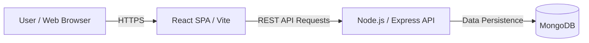
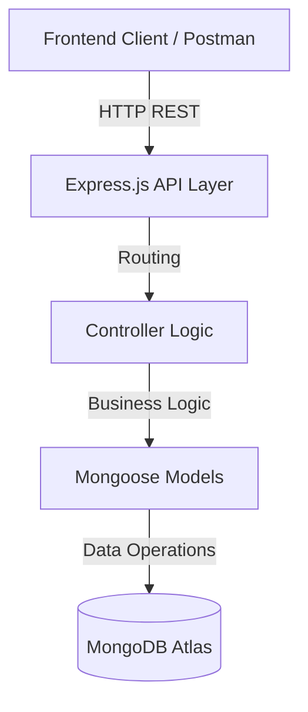

# Replate - Food Redistribution Platform (Frontend)

This repository contains the frontend web application for **Replate**, a community-driven platform designed to reduce food waste by connecting surplus food donors with NGOs and volunteers.

---
## Deployment Links
Backend - https://replate-backend-hhk7.onrender.com
Frontend - https://replate-frontend.onrender.com
---

## 📑 Table of Contents
1. [Introduction](#1-introduction)
2. [System Architecture](#2-system-architecture)
3. [Technology Stack](#3-technology-stack)
4. [Repository Structure](#4-repository-structure)
5. [CI/CD Pipeline](#5-ci-cd-pipeline)
6. [Local Development Setup](#6-local-development-setup)
7. [Deployment Process](#7-deployment-process)
8. [Monitoring & Logging](#8-monitoring--logging)
9. [Security Considerations](#9-security-considerations)
10. [License](#license)

---

## 🛠️ DevOps & Developer Documentation (DevDocs)

### 1. Introduction
The **Replate Frontend** serves as the client-side interface for all platform roles. It provides a responsive and intuitive dashboard for donors to list food, NGOs to claim requests, and volunteers to manage deliveries. The goal is to facilitate seamless, real-time coordination to ensure surplus food reaches those in need efficiently.

### 2. System Architecture
The frontend is built as a Single Page Application (SPA) using React and Vite. It follows a modular component-based architecture and communicates with the backend via RESTful APIs.



*   **Routing**: Client-side navigation handled by `react-router-dom`.
*   **State Management**: Optimized using React Context API and local state hooks.
*   **Maps Integration**: Real-time visualization using `react-leaflet`.

### 3. Technology Stack
*   **Core Framework**: React (v19)
*   **Build Tool**: Vite (Next-generation frontend tool)
*   **Styling**: Tailwind CSS (Utility-first CSS framework)
*   **Icons**: Lucide React
*   **HTTP Client**: Axios
*   **Testing**: Playwright (E2E testing)

### 4. Repository Structure
The Replate Frontend is structured to support complex role-based routing and a sophisticated design system.

#### 📂 Directory Tree
```text
replate-frontend/
├── public/                 # Static assets (logos, icons, manifests)
├── src/
│   ├── api/                # Axios API services for each module (Admin, Auth, Donation)
│   ├── assets/             # Global styles and static images
│   ├── components/         # Modular UI elements
│   │   ├── donate/         # Multi-step donation form components
│   │   ├── Sidebar.jsx     # Dynamic navigation sidebar
│   │   └── DashboardLayout.jsx # Base shell for protected views
│   ├── hooks/              # Custom React hooks (Voice Recognition, Notifications)
│   ├── icons/              # Optimized Icon components
│   ├── pages/              # Primary view controllers
│   │   ├── admin/          # Specialized administrative sub-pages
│   │   ├── Login.jsx       # Unified authentication entry
│   │   └── Impact.jsx      # Sustainability and stats visualization
│   ├── App.jsx             # Main routing and provider configuration
│   └── main.jsx            # Application bootstrap entry point
└── tests/                  # Playwright E2E automation suites
```

#### 🧩 Component Breakdown
| Module | Description |
| :--- | :--- |
| **`src/components/donate`** | Contains steps for `CategoryStep`, `FoodDetailsStep`, `PickupStep`, and `SummaryStep`. |
| **`src/pages/admin`** | Includes `UserManagement`, `Logistics`, `VerificationRequests`, and `DonationApproval`. |
| **`src/api/`** | Service-oriented classes (e.g., `admin.js`, `donation.js`) that encapsulate back-end communication. |
| **`src/hooks/`** | Shares logic like `useVoiceRecognition` for accessibility features across the platform. |

### 5. CI/CD Pipeline
We leverage automated workflows to maintain high code quality and reliable deployments.

*   **Continuous Integration (CI)**:
    - Automatically triggered on `push` and `pull_request` to `main`.
    - Installs dependencies using `npm ci`.
    - Runs **Playwright** E2E tests to prevent regressions.
    - Configured in `.github/workflows/playwright.yml`.

*   **Continuous Deployment (CD)**:
    - Successfully tested builds are eligible for deployment to **GitHub Pages** or **Render**.
    - The `npm run deploy` script handles the production build and synchronization.

### 6. Local Development Setup
Follow these steps to set up the project on your local machine:

1. **Prerequisites**: Ensure you have [Node.js](https://nodejs.org/) (v18+) installed.
2. **Installation**:
   ```bash
   npm install
   ```
3. **Environment**: Create a `.env` file in the root:
   ```env
   VITE_API_URL=http://localhost:5000
   ```
4. **Execution**: Start the dev server:
   ```bash
   npm run dev
   ```

### 7. Deployment Process
1. **Build**: Create an optimized production bundle:
   ```bash
   npm run build
   ```
2. **Preview**: Verify the build locally:
   ```bash
   npm run preview
   ```
3. **Deploy**: Push to the `main` branch to trigger the automated deployment pipeline on the hosting provider (e.g., Render/GitHub Pages).

### 8. Monitoring & Logging
*   **Infrastructure Logs**: Build and deployment statuses are monitored through **GitHub Actions** and the hosting provider's dashboard.
*   **Error Tracking**: Production errors are identified through browser-based console monitoring and deployment platform logs.
*   **Performance Monitoring**: Vite's build reports provide insights into bundle sizes and asset optimization.

### 9. Security Considerations
*   **Environment variable protection**: Critical API endpoints are managed via environment variables and never exposed in the source code.
*   **Stateless Auth**: Uses JWT (JSON Web Tokens) stored in secure browser storage for session management.
*   **RBAC Implementation**: Frontend routing guards ensure users can only access views authorized for their specific role (Donor, NGO, Volunteer, Admin).
*   **XSS Protection**: React's built-in data binding prevents most common cross-site scripting attacks.

---

# Replate - Food Redistribution Platform (Backend)

This repository contains the backend API for **Replate**, handling data persistence, authentication, and core business logic for the food redistribution ecosystem.

---

## 📑 Table of Contents
1. [Introduction](#1-introduction)
2. [System Architecture](#2-system-architecture)
3. [Technology Stack](#3-technology-stack)
4. [Repository Structure](#4-repository-structure)
5. [CI/CD Pipeline](#5-ci-cd-pipeline)
6. [Local Development Setup](#6-local-development-setup)
7. [Deployment Process](#7-deployment-process)
8. [Monitoring & Logging](#8-monitoring--logging)
9. [Security Considerations](#9-security-considerations)
10. [License](#license)

---

## 🛠️ DevOps & Developer Documentation (DevDocs)

### 1. Introduction
The **Replate Backend** is a RESTful API service built with Node.js and Express. It acts as the central hub connecting donors, NGOs, and volunteers. It manages user accounts, donation tracking, logistics assignments, and impact analytics, ensuring a reliable and secure experience for all stakeholders.

### 2. System Architecture
The backend follows the **Model-View-Controller (MVC)** pattern to ensure scalability and ease of testing. It utilizes MongoDB for flexible, document-based data storage.



*   **Data Layer**: Mongoose ODM for schema definition and validation.
*   **Auth Layer**: Stateless JWT-based authentication.

### 3. Technology Stack
*   **Runtime**: Node.js
*   **Framework**: Express.js
*   **Database**: MongoDB (Mongoose)
*   **Security**: bcryptjs (Hashing), JSON Web Token (JWT)
*   **Middleware**: CORS, Express-Validator
*   **Testing**: Jest, Supertest

### 4. Repository Structure
The Replate Backend follows a clean separation of concerns using the Controller-Service-Model pattern.

#### 📂 Directory Tree
```text
replate-backend/
├── config/                 # Infrastructure setup (Database connection)
├── controllers/            # Business logic handlers for all API modules
│   ├── adminController.js     # User management & platform-wide stats
│   ├── donationController.js  # Donation lifecycles (pending -> delivered)
│   └── impactController.js   # Sustainability score calculations
├── middleware/             # Request interceptors (Auth protection, Admin-only)
├── models/                 # Mongoose Data Schemas (User, Donation, Assignment)
├── routes/                 # Express REST endpoint definitions
├── scripts/                # Maintenance tools (Inventory cleanup, Cron jobs)
├── utils/                  # Helper utilities (Coordinate distance calculators)
├── server.js               # Application entry point & configuration
└── Replate_API_Collection.json # Postman integration file
```

#### 🏗️ Logic & Data Modules
| Module | Components Involved | Responsibility |
| :--- | :--- | :--- |
| **Authentication** | `authController`, `User` model, `auth` middleware | Registration, Login, and JWT Token validation. |
| **Logistics** | `assignmentController`, `requestController` | Managing volunteer-food-NGO connections and routing. |
| **Impact** | `impactController`, `Donation` model | Real-time tracking of CO2 reduction and meals saved. |
| **Notifications** | `notificationController` | Real-time alerts for donors and NGOs. |

### 5. CI/CD Pipeline
*   **Quality Assurance**: Automated testing using **Jest** and **Supertest** ensures that every API endpoint returns expected results before deployment.
*   **Automated Deployment**:
    1. Developers push code to the `main` branch.
    2. **Render** (Cloud Platform) detects the push via Webhooks.
    3. The build process installs dependencies and starts the server.
    4. Health checks verify the application is running before routing production traffic.

### 6. Local Development Setup
To run the API server locally:

1. **Prerequisites**: Install [Node.js](https://nodejs.org/) and have access to a [MongoDB](https://www.mongodb.com/) instance.
2. **Installation**:
   ```bash
   npm install
   ```
3. **Environment**: Configure `.env` with the following:
   ```env
   PORT=5000
   MONGODB_URI=your_mongodb_connection_string
   JWT_SECRET=your_secret_key
   ```
4. **Execution**:
   - `npm run dev`: Starts the server with hot-reloading (via nodemon).
   - `npm start`: Standard production startup.

### 7. Deployment Process
The system is optimized for cloud deployment (e.g., Render, AWS, or Heroku):
1. **Branch Management**: All production-ready code is merged into the `main` branch.
2. **Environment Variables**: Confidential keys (DB URI, JWT secret) are injected via the hosting platform's environment manager.
3. **Build & Release**: The platform executes `npm install` followed by `npm start`, with automated rollback capabilities if deployment fails.

### 8. Monitoring & Logging
*   **Platform Dashboard**: Real-time traffic monitoring and CPU/Memory usage via the **Render** dashboard.
*   **Database Insights**: Query performance and storage limits tracked through **MongoDB Atlas**.
*   **Application Logs**: Detailed runtime logs captured for debugging and traffic analysis.

### 9. Security Considerations
*   **Encryption**: All user passwords are irreversibly hashed using `bcryptjs` before storage.
*   **Stateless Security**: JWT authentication ensures that no session data is stored on the server, enhancing scalability and security.
*   **Input Sanitization**: Use of `express-validator` to prevent SQL/NoSQL injection and malformed data entries.
*   **CORS**: Restricted access to prevent unauthorized domains from interacting with the API.

---

### Contributors
Ananya BM - CB.SC.U4CSE23708
Parvathy Krishna - CB.SC.UCSE23739
Shruti Shri A - CB.SC.U4CSE23749
V Sanjana - CB.SC.U4CSE23751
